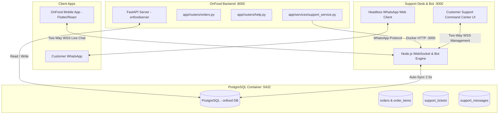
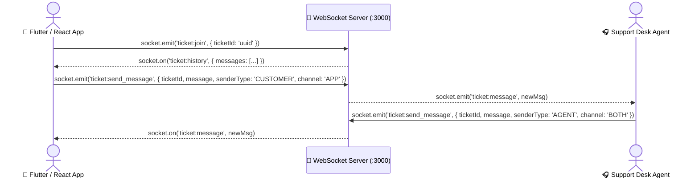

# OnFood Backend Server Communication Guide
## Connecting `onfoodserver` (FastAPI) to `onfood-whatsapp-bot` (Support Desk & WhatsApp Engine)

> **Target Audience:** Backend Developers, Mobile/Frontend Engineers, DevOps  
> **Last Updated:** October 2026  
> **Database:** Local PostgreSQL (`onfood` database on port `5432`)  
> **Network:** Docker bridge network `onfoodserver_default`

---

## 1. System Architecture & Communication Flow

Both services run as Docker containers connected via the same network and database:



---

## 2. Network Addresses & Discovery

| Environment | From | To Support Server | Address |
| :--- | :--- | :--- | :--- |
| **Inside Docker** | `onfoodserver` container | `onfood-whatsapp-bot` | `http://onfood-whatsapp-bot:3000` |
| **Host Machine (Local Dev)** | Windows / Mac Host | Support Server | `http://localhost:3000` |
| **Mobile / Frontend Client** | Android Emulator / Phone | WebSocket Gateway | `http://10.0.2.2:3000` (Android) or `http://<LAN_IP>:3000` |
| **PostgreSQL Database** | Both Containers | Database Port | `onfood-postgres:5432` (Docker) or `localhost:5432` |

---

## 3. Shared Database Schema Contract

Both `onfoodserver` and the Support Bot connect to the `onfood` database using identical table contracts:

### A. `support_tickets`
| Column | Type | Description |
| :--- | :--- | :--- |
| `id` | `UUID` (or VARCHAR) | Primary key (e.g. `gen_random_uuid()`) |
| `user_id` | `VARCHAR(64)` | References `users(id)` |
| `order_id` | `VARCHAR(64)` | References `orders(id)` (nullable) |
| `subject` | `VARCHAR(200)` | Ticket issue category / title |
| `message` | `TEXT` | Initial customer problem description |
| `status` | `ticket_status` enum | `'OPEN'`, `'IN_PROGRESS'`, `'RESOLVED'` |
| `created_at` | `TIMESTAMP WITH TZ` | Creation timestamp (`NOW()`) |
| `updated_at` | `TIMESTAMP WITH TZ` | Last updated timestamp |

### B. `support_messages`
| Column | Type | Description |
| :--- | :--- | :--- |
| `id` | `UUID` | Primary key (`gen_random_uuid()`) |
| `ticket_id` | `UUID` | Foreign key referencing `support_tickets(id)` |
| `sender_type` | `VARCHAR(20)` | `'CUSTOMER'` or `'AGENT'` |
| `sender_id` | `VARCHAR(64)` | User ID or Agent ID |
| `sender_name` | `VARCHAR(100)`| e.g. `'Customer'`, `'Support Staff'` |
| `message` | `TEXT` | Message content |
| `channel` | `VARCHAR(20)` | `'APP'`, `'WHATSAPP'`, or `'BOTH'` |
| `created_at` | `TIMESTAMP WITH TZ` | Message timestamp (`NOW()`) |

---

## 4. HTTP REST API Reference (FastAPI ➔ Support Server)

When `onfoodserver` needs to notify the Support Desk or trigger an action, make standard HTTP requests to `http://onfood-whatsapp-bot:3000`:

### 4.1 Proactive Delay Alert & ETA Extension
When kitchen backlog causes order delays, send an automated alert to the customer and update the Support Command Desk.

- **Endpoint:** `POST /api/orders/{orderId}/delay-alert`
- **Request Headers:** `Content-Type: application/json`
- **Request Body:**
  ```json
  {
    "minutes": 10,
    "message": "⏱️ Update on your OnFood Order #ORD-101: Your meal is taking a few extra minutes. New estimated readiness: 08:15 PM."
  }
  ```
- **Response (200 OK):**
  ```json
  {
    "ok": true,
    "orderId": "ORD-101",
    "etaTimestamp": 1791060051657,
    "sentWhatsApp": true,
    "message": "..."
  }
  ```

---

### 4.2 Send WhatsApp OTP / Account Verification
Deliver high-priority OTP codes through WhatsApp.

- **Endpoint:** `POST /internal/whatsapp/send-otp`
- **Request Headers:**
  - `Content-Type: application/json`
  - `x-internal-api-key: <INTERNAL_API_KEY>` (set in `.env`)
- **Request Body:**
  ```json
  {
    "phone": "9876543210",
    "otp": "492015",
    "expiresInMinutes": 5
  }
  ```
- **Response (200 OK):**
  ```json
  { "ok": true }
  ```

---

### 4.3 Direct Message Dispatch (Omnichannel: App / WhatsApp / Both)
Send a support message to a specific customer phone number or active ticket.

- **Endpoint:** `POST /api/messages/send`
- **Request Body:**
  ```json
  {
    "phone": "9876543210",
    "message": "Your order is ready for pickup at Counter 1!",
    "channel": "BOTH"
  }
  ```
  *(Supported channels: `"WHATSAPP"`, `"APP"`, `"BOTH"`)*

---

### 4.4 Create Support Ticket
Create a ticket from the backend or mobile client.

- **Endpoint:** `POST /api/tickets/create`
- **Request Body:**
  ```json
  {
    "orderId": "ORD-101",
    "userPhone": "9876543210",
    "category": "Delay in Order",
    "description": "Customer called reporting meal delayed by 15 mins"
  }
  ```
- **Response (200 OK):**
  ```json
  {
    "ok": true,
    "ticketId": "f55c29dc-35cd-4a13-a6f0-9236b83fdfc2"
  }
  ```

---

## 5. Ready-To-Use Python Client for `onfoodserver`

Copy this service module directly into your FastAPI backend at:  
`onfoodserver/app/services/support_service.py`

```python
"""
Support Service Client for OnFood Backend
Connects onfoodserver (FastAPI) to onfood-whatsapp-bot container via HTTP.
"""
import os
import logging
from typing import Optional, Dict, Any
import httpx

logger = logging.getLogger(__name__)

SUPPORT_BOT_BASE_URL = os.getenv("SUPPORT_BOT_URL", "http://onfood-whatsapp-bot:3000")
INTERNAL_API_KEY = os.getenv("INTERNAL_API_KEY", "")


class SupportServiceClient:
    def __init__(self, base_url: str = SUPPORT_BOT_BASE_URL):
        self.base_url = base_url.rstrip("/")

    async def send_delay_alert(
        self,
        order_id: str,
        buffer_minutes: int = 10,
        custom_message: Optional[str] = None
    ) -> Dict[str, Any]:
        """Notify support desk and customer of order delay."""
        url = f"{self.base_url}/api/orders/{order_id}/delay-alert"
        payload = {"minutes": buffer_minutes}
        if custom_message:
            payload["message"] = custom_message

        try:
            async with httpx.AsyncClient(timeout=6.0) as client:
                res = await client.post(url, json=payload)
                res.raise_for_status()
                return res.json()
        except Exception as exc:
            logger.error("Failed to notify support desk of delay on order %s: %s", order_id, exc)
            return {"ok": False, "error": str(exc)}

    async def send_whatsapp_otp(
        self,
        phone: str,
        otp_code: str,
        expires_minutes: int = 5
    ) -> bool:
        """Send verification OTP code via WhatsApp."""
        url = f"{self.base_url}/internal/whatsapp/send-otp"
        headers = {"x-internal-api-key": INTERNAL_API_KEY}
        payload = {
            "phone": phone,
            "otp": str(otp_code),
            "expiresInMinutes": expires_minutes
        }

        try:
            async with httpx.AsyncClient(timeout=8.0) as client:
                res = await client.post(url, json=payload, headers=headers)
                return res.status_code == 200
        except Exception as exc:
            logger.error("Failed to send WhatsApp OTP to %s: %s", phone, exc)
            return False

    async def send_customer_message(
        self,
        phone: str,
        message: str,
        channel: str = "BOTH"  # 'WHATSAPP' | 'APP' | 'BOTH'
    ) -> Dict[str, Any]:
        """Send message to customer via chosen channel."""
        url = f"{self.base_url}/api/messages/send"
        payload = {
            "phone": phone,
            "message": message,
            "channel": channel.upper()
        }

        try:
            async with httpx.AsyncClient(timeout=8.0) as client:
                res = await client.post(url, json=payload)
                return res.json()
        except Exception as exc:
            logger.error("Failed to send customer message to %s: %s", phone, exc)
            return {"ok": False, "error": str(exc)}


# Global client singleton instance
support_client = SupportServiceClient()
```

### Usage Example in `onfoodserver/app/routers/orders.py`:
```python
from app.services.support_service import support_client

@router.patch("/{order_id}/delay")
async def flag_kitchen_delay(order_id: str, minutes: int = 10):
    # 1. Update database
    ...
    # 2. Trigger automated Support Desk & WhatsApp notification
    await support_client.send_delay_alert(
        order_id=order_id,
        buffer_minutes=minutes
    )
    return {"status": "delayed_notice_sent"}
```

---

## 6. Two-Way WebSocket (WSS) Live Chat Integration

For real-time In-App customer support chat, clients connect directly via Socket.IO:

- **Socket URL:** `http://<SERVER_HOST>:3000`
- **Transport:** `websocket`, `polling`

### Client Event Protocol



### Flutter / JavaScript Client Implementation

```javascript
import io from 'socket.io-client';

// 1. Establish socket connection
const socket = io('http://localhost:3000', {
  transports: ['websocket']
});

// 2. Join specific ticket room
socket.emit('ticket:join', { ticketId: 'f55c29dc-35cd-4a13-a6f0-9236b83fdfc2' });

// 3. Receive message history
socket.on('ticket:history', (data) => {
  console.log('Thread history:', data.messages);
});

// 4. Listen for real-time incoming messages from support staff
socket.on('ticket:message', (msg) => {
  console.log('Incoming message:', msg.message, 'via', msg.channel);
  renderMessageBubble(msg);
});

// 5. Send message from customer
function sendCustomerMessage(text) {
  socket.emit('ticket:send_message', {
    ticketId: 'f55c29dc-35cd-4a13-a6f0-9236b83fdfc2',
    message: text,
    senderType: 'CUSTOMER',
    senderName: 'Customer',
    channel: 'APP' // Delivered in-app
  });
}
```

---

## 7. Environment Variables Configuration

Add these variables to `onfoodserver/.env`:

```ini
# Support Bot Container Address (Docker Network)
SUPPORT_BOT_URL=http://onfood-whatsapp-bot:3000

# Shared Secret Key for Internal APIs (OTP dispatch)
INTERNAL_API_KEY=your_secure_internal_api_key_here

# PostgreSQL Database (identical to support bot)
PG_HOST=onfood-postgres
PG_PORT=5432
PG_USER=buvvadb
PG_PASSWORD=buvvA@6
PG_DATABASE=onfood
```

And in `whatsapp_bot/whatsapp_bot/.env`:
```ini
PORT=3000
INTERNAL_API_KEY=your_secure_internal_api_key_here
PG_HOST=onfood-postgres
PG_PORT=5432
PG_USER=buvvadb
PG_PASSWORD=buvvA@6
PG_DATABASE=onfood
```

---

## 8. Verification & Health Check

To test communication between containers from PowerShell or terminal:

```powershell
# 1. Health check Support Server from host:
curl.exe -s http://localhost:3000/api/summary

# 2. Test internal network ping from onfoodserver container:
docker exec onfoodserver curl -s http://onfood-whatsapp-bot:3000/api/summary

# 3. Test sending a test message via Docker:
$body = '{"phone":"9876543210","message":"Backend connection test","channel":"APP"}';
Invoke-RestMethod -Uri 'http://localhost:3000/api/messages/send' -Method Post -Body $body -ContentType 'application/json'
```
